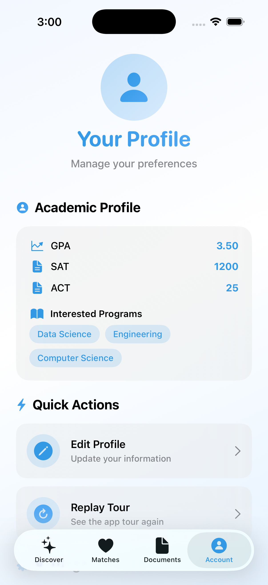
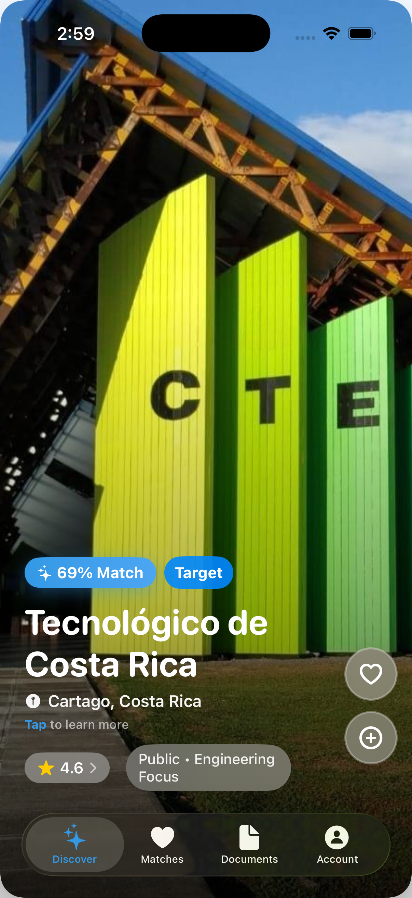
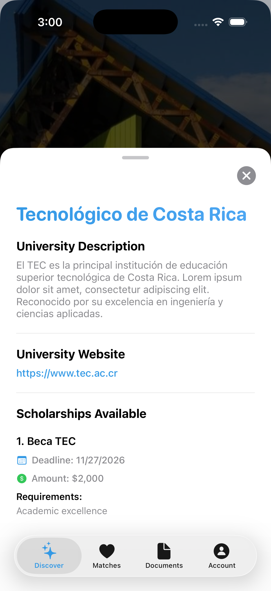
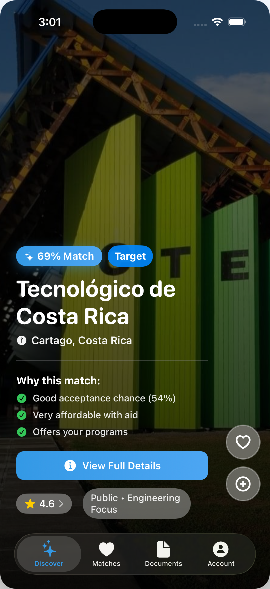
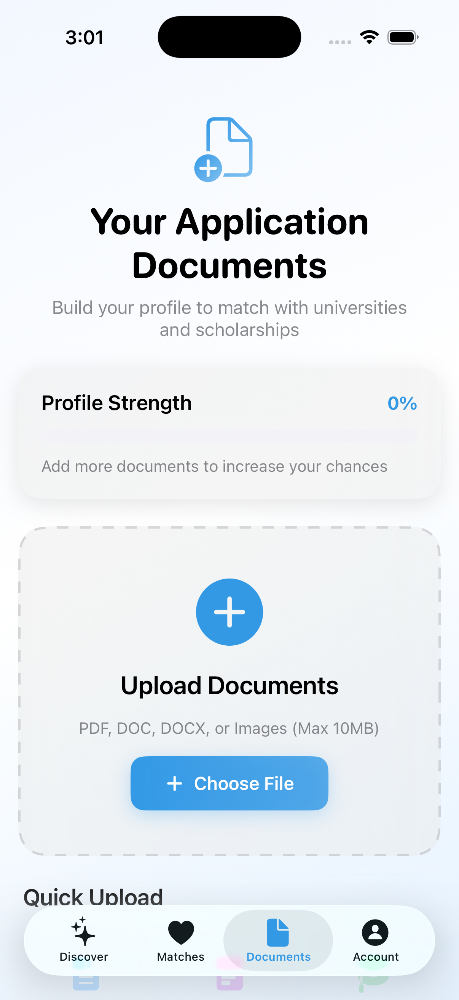

# Astra

A native iOS application built with **SwiftUI** that helps students discover universities tailored to their academic profile, financial situation, and personal preferences.

Astra combines a recommendation engine with an intuitive interface to rank universities based on multiple weighted factors, helping students make more informed decisions during the university application process.

---

## Features

### Personalized University Recommendations

* Smart university ranking based on user profile
* Multi-factor recommendation algorithm
* Acceptance probability estimation
* Personalized match explanations
* Ranked university list
* Scholarship recommendation system
* University search filters

### Student Profile

* Academic information
* GPA and standardized test scores
* Budget preferences
* Intended field of study
* Personal preferences

### University Information

* Tuition costs
* Acceptance rates
* Minimum admission requirements
* Academic programs
* Campus information
* Student reviews
* Detailed university profiles

### Document Management

* Upload resumes and CVs
* Store transcripts
* Manage recommendation letters
* Organize certificates and diplomas
* Track application documents

### Modern User Experience

* Native SwiftUI interface
* Smooth animations
* Responsive layouts
* Dark mode support
* Interactive university cards

---

## Recommendation Algorithm

Astra evaluates each university using a weighted scoring system based on four primary categories:

| Category               | Weight |
| ---------------------- | ------ |
| Acceptance Probability | 35%    |
| Affordability          | 30%    |
| Program Match          | 25%    |
| Personal Preferences   | 10%    |

Each recommendation includes both positive and negative factors, allowing users to understand why a university was ranked at a particular position.

---

## Technologies Used

### Languages

* Swift

### Frameworks

* SwiftUI
* Foundation
* UniformTypeIdentifiers

### Features

* Custom recommendation engine
* Local document management
* Dynamic ranking algorithms
* Interactive animations
* Data persistence
  
---

## Project Structure

```text
Astra/
├── RecommendationEngine.swift
├── ContentView.swift
├── profileSetup.swift
├── userProfile.swift
├── SchoolInfo.swift
├── matches.swift
├── data.swift
├── dataStructure.swift
├── account.swift
├── apptour.swift
├── start.swift
├── Myapp.swift
├── Package.swift
└── Assets.xcassets/
```

---

## Screenshots







---

## What I Learned

Developing Astra provided experience with:

* Native iOS application development
* SwiftUI architecture
* Recommendation system design
* Multi-factor decision algorithms
* User profile modeling
* Data-driven application design
* Document management
* Designing interfaces for complex information

---

## Future Improvements

Potential future enhancements include:

* Live university database integration
* AI-powered university matching
* SAT/IB score prediction
* Application deadline tracking
* College comparison tools
* Cloud synchronization

---

## License

This project is licensed under the MIT License.about 

### Third-Party Assets

Some images and logos included in this repository are the property of their respective owners and are provided solely for demonstration purposes. They are not covered by the MIT License.
